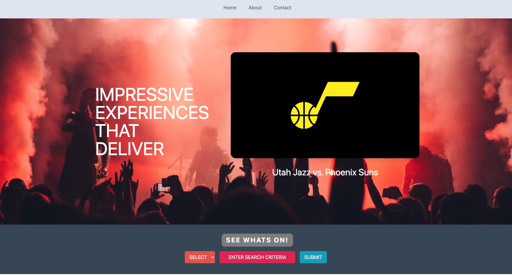
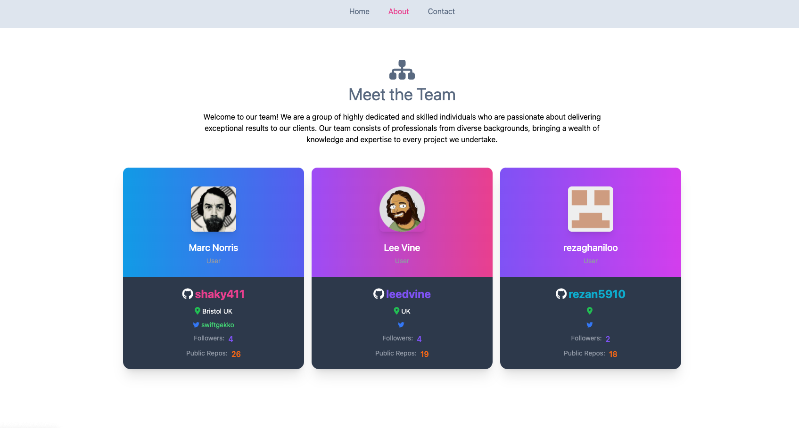
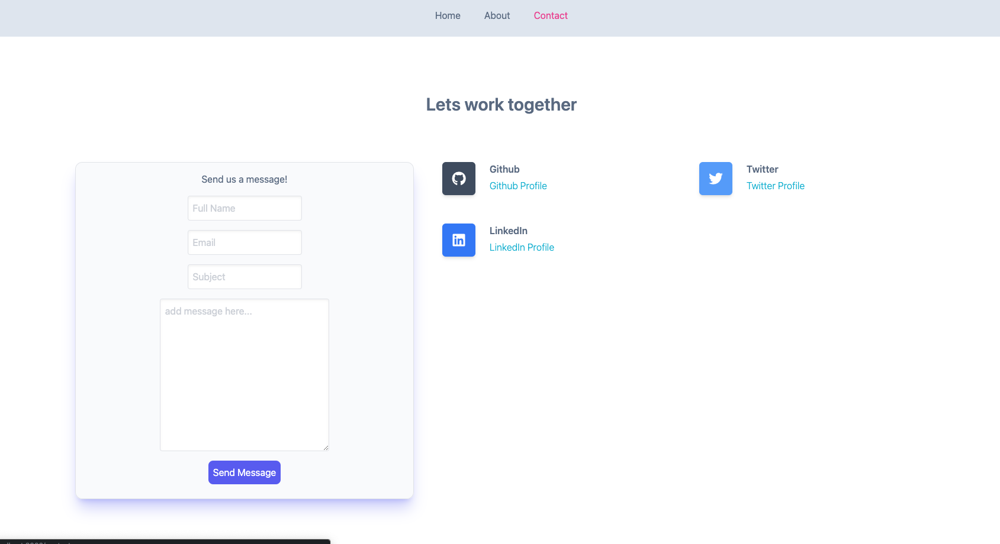
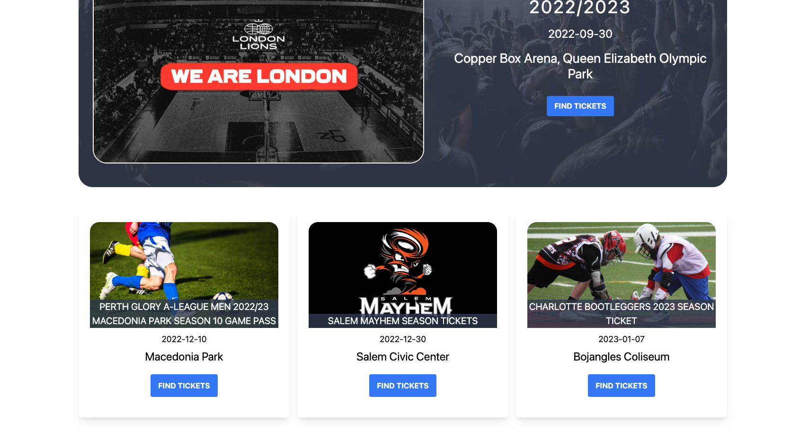

# GIG-11 

## Table of contents

- [Overview](#overview)
- [Instalation and Setup instruction](#🛠-installation-and-setup-instructions)
- [Acceptance Criteria](#acceptance-criteria)
- [Application Screenshot](#application-screenshot)
- [Links](#links)
- [Built with](#built-with)
- [What we learned](#what-we-learned)
- [Useful resources](#useful-resources)
- [Authors](#authors)
- [Acknowledgments](#acknowledgments)

## Overview

GIG-11 provides a one-stop-shop for finding and purchasing tickets to your favorite events. Our application focuses on a clean interface and ease of use, whether you're OTG or at your desk.  

By leveraging the latest technologies you can easily find the best ticket options that match your preferences and budget.  

We simplify the ticket searching process, saving you time, money, and hassle.
  

## 🛠 Installation and Setup Instructions

    Installation: npm install

    In the project directory, you can run: npm start

Runs the app in the development mode.
Open http://localhost:3000 to view it in the browser. The page will reload if you make edits.
## Acceptance Criteria

 ### Application Requirments

- [ ] Use React
- [ ] Use Node.JS
- [ ] Have a GET Route
- [ ] Deployed on Netlify
- [ ] Use of at least 2 libraries,packages or technologies
- [ ] Polished UI
- [ ] Good code quality standards (Indet,scoping,naming)
- [ ] good quality README.md

### Presentation Requirements

- [ ] Elevator pitch: a one minute description of your application.
- [ ] Concept: What is your user story? What was your motivation for development?
- [ ] Process: What were the technologies used? How were tasks and group roles broken down and assigned? What challenges did you encounter? What were your successes?
- [ ] Demo: Show your stuff!
- [ ] Directions for future development
- [ ] Links to to the deployed application and the GitHub repository

## Application Screenshot

## Links

[GIG-11](https://dreamy-granita-5fb38d.netlify.app/)

## Built with...

[React.js](https://react.dev/)  
[Tailwind CSS](https://tailwindcss.com/)  
[React Router](https://reactrouter.com/en/main)  
[Email.js](https://www.emailjs.com/)  
[Ticketmaster API](https://developer.ticketmaster.com/products-and-docs/apis/getting-started/)  
[Github API](https://github.com/)  

## What we learned

## Useful Resources
 

## Authors
[Reza Ghaniloo](https://github.com/rezan5910)  

[Marc Norris](https://github.com/shaky411)  

[Lee Vine](https://github.com/leedvine)  
 

## Acknowledgments

Thanks to our instructor Dane and all the TAs, and special thanks to Jonathan, Luis and Andrew for supporting us during our times of difficulty.

   